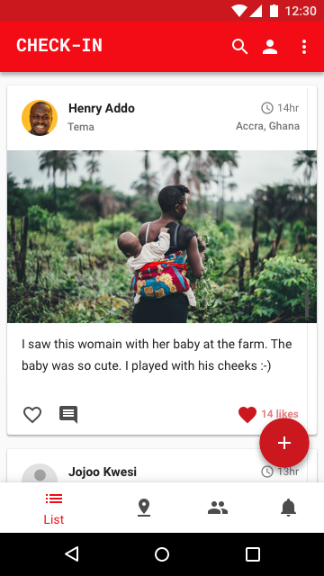
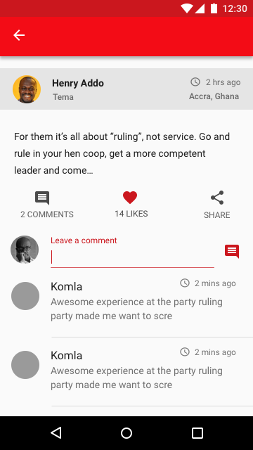
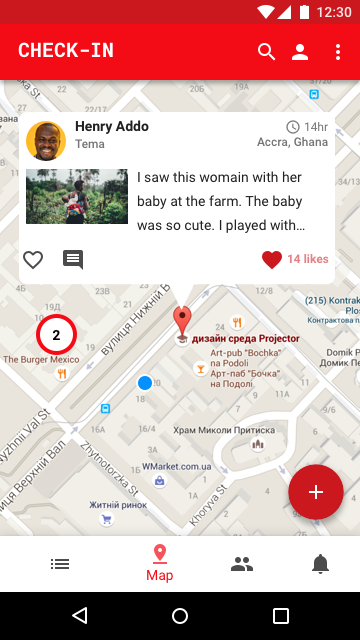

# Check-In - Work In Progress

A free and open source Android app for posting your current update to your followers. It uses an approximation of your current location and plots it on a map. You can also see your followers recently updated statuses.
 
**Note:** This is an educational and exploratory code base to facilitate learning new Android development patterns and the Kotlin programming language features. Though the intention is to release it on the app store at some point, it's not the ultimate goal. This will stay forever as a work in progress.

# Features

   

# Development setup

You will need the latest Android studio(3.2 or above) to start developing.

1. [Fork](https://help.github.com/articles/fork-a-repo/) and clone the repository.
2. Change to `checkin` directory.
3. Issue `./gradlew clean build` to build the app.

# Contributions

We welcome and encourage contributions. We will appreciate any helping hand you can give. 

We use Github's [issues](https://github.com/eyedol/checkin/issues) and project features to manage tasks. Look through the [project board](https://github.com/eyedol/checkin/projects/1) to see which pending tasks are available for grabs.

If you would like to contribute code to the project, you can do so by [forking](https://guides.github.com/activities/forking/) the [repository](https://github.com/eyedol/checkin) and sending a pull request. We will review your code. If everything with the pull request looks good, we will merge your changes.

**Note:** For your contribution to be accepted into the project, you must sign the [Individual Contributor License Agreement (CLA)](https://www.clahub.com/agreements/eyedol/checkin). You can read more about it [here](https://en.wikipedia.org/wiki/Contributor_License_Agreement).

# License

    MIT License

    Copyright (c) 2017 Henry Addo

    Permission is hereby granted, free of charge, to any person obtaining a copy
    of this software and associated documentation files (the "Software"), to deal
    in the Software without restriction, including without limitation the rights
    to use, copy, modify, merge, publish, distribute, sublicense, and/or sell
    copies of the Software, and to permit persons to whom the Software is
    furnished to do so, subject to the following conditions:

    The above copyright notice and this permission notice shall be included in all
    copies or substantial portions of the Software.

    THE SOFTWARE IS PROVIDED "AS IS", WITHOUT WARRANTY OF ANY KIND, EXPRESS OR
    IMPLIED, INCLUDING BUT NOT LIMITED TO THE WARRANTIES OF MERCHANTABILITY,
    FITNESS FOR A PARTICULAR PURPOSE AND NONINFRINGEMENT. IN NO EVENT SHALL THE
    AUTHORS OR COPYRIGHT HOLDERS BE LIABLE FOR ANY CLAIM, DAMAGES OR OTHER
    LIABILITY, WHETHER IN AN ACTION OF CONTRACT, TORT OR OTHERWISE, ARISING FROM,
    OUT OF OR IN CONNECTION WITH THE SOFTWARE OR THE USE OR OTHER DEALINGS IN THE
    SOFTWARE.